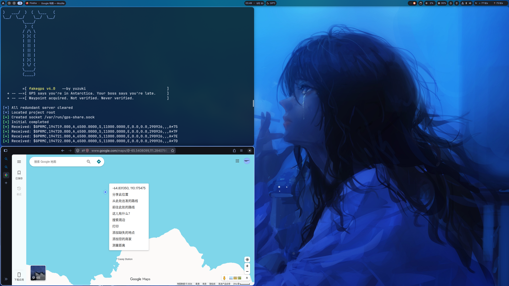

# fakegps
> Make a fake NMEA flow feed Geoclue to custom GPS position
## Effect
According to the real test, fakegps can fully fake the Google maps, Amap, GNOME map and most maps. You can use fakegps to make your GPS position be wherever you want. By the way, fakegps hijack the system global GPS position so that everything using GPS will use the location that you give.
## Environment

OS: Linux

Compile: gcc

Dependencies: geoclue, socat, avahi

## Usage
first time
```bash
git clone https://github.com/yuzuki-77i/fakegps.git
cd fakegps
make
```
### basic usage
```bash
bin/fakegps N 12 E 34 -v --avahi

[*] All redundant server cleared
[*] Located project root
[+] Avahi-publish-service up
[+] Socat connected at TCP 5000
[+] Initial completed
[+] Received: $GPRMC,191100.000,A,1200.0000,N,03400.0000,E,0.0,0.0,290926,,,A*64
[+] Received: $GPRMC,191101.000,A,1200.0000,N,03400.0000,E,0.0,0.0,290926,,,A*65
[+] Received: $GPRMC,191102.000,A,1200.0000,N,03400.0000,E,0.0,0.0,290926,,,A*66
[+] Received: $GPRMC,191103.000,A,1200.0000,N,03400.0000,E,0.0,0.0,290926,,,A*67
...
```
### use script mode
Use `-s` will make fakegps follow your route by the routefile you give

This circle.txt is a simple example. You can load your own routefie by following format:
`<N/S>,<lat>,<E/W>,<lon>,<speed>	#parameters default is 0 except N/S,E/W have no default value`

```bash
sudo bin/fakegps -s assets/circle.txt -v

[*] All redundant server cleared
[*] Located project root
[+] Created socket /var/run/gps-share.sock
[+] Initial completed
[+] Loaded routefile "assets/circle.txt"
[+] Received: $GPRMC,203333.000,A,3954.2700,N,11623.5800,E,0.0,0.0,290926,,,A*6E
[+] Received: $GPRMC,203334.000,A,3954.2700,N,11624.0600,E,0.0,0.0,290926,,,A*65
[+] Received: $GPRMC,203335.000,A,3954.6600,N,11624.0600,E,0.0,0.0,290926,,,A*61
[+] Received: $GPRMC,203336.000,A,3954.6600,N,11623.5800,E,0.0,0.0,290926,,,A*6E
...
```
Use this will show help detail:  `bin/fakegps -h`

## Live demo



## How it works && Notice
### Geoclue
Geoclue is the Linux basic positioning service. **Before you use fakegps for the first time, confirm that you have edited /etc/geoclue/geoclue.conf at first!** Disable the ip and wifi source, and enable the network-nmea so that fakegps works successfully.

### Unix-socket
If you open geoclue.conf, you will see this:
`# Use an NMEA unix socket as the data source
nmea-socket=/var/run/gps-share.sock`
This path needs root privilege. If you want to use a custom socket path to avoid using sudo, you can edit this and use the flag `--socket-path` to pick a path you like. But this one should always be the same to the line in geoclue.conf, that means you should change the path both in conf and argument.

### avahi-publish-server
Avahi-publish-server can publish the fake NMEA flow to the whole WLAN. If you want to share this NMEA with your other devices or VMs, use `--avahi` may help.
